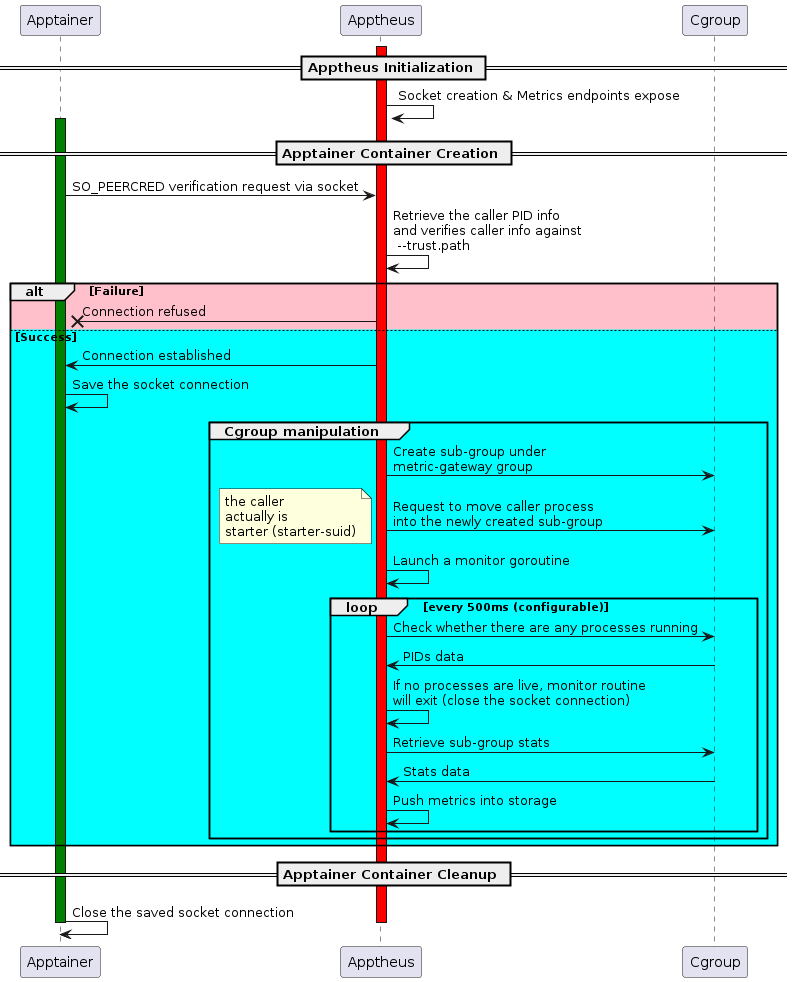

# Apptheus

A redesigned Prometheus Pushgateway for ephemeral and batch jobs.

## Background
To provide a unified way of collecting the Apptainer stats data. We plan to employ the cgroup feature, which requires putting starter (starter-suid) program under a created
sub cgroup so that container stats can be collected and visualized.

To collect the cgroup stats, we are planning to deeply custormize the [Pushgateway](https://github.com/jasonyangshadow/apptheus) tool, tailing features and adding additional security policy. We call this tool `Apptheus`, meaning Apptainer links to Prometheus.

> Note that this tool can be used for monitoring any programs, this tool comes from the development of one Apptainer RFE.

## Features
1. Disabled the default Pushgateway's push endpoints for security purpose, so users can not directly push the data to Apptheus. Push can only be called via internal function calls.
2. Added a customized verification step, any incoming request through a unix socket will be verified (Check whether the process is trusted one).
3. Apptheus can manipulate the cgroup and put the process into a newly created cgroup sub group and collect cgroup stat.
4. The only available endpoint is:
```
GET /metrics
```

## Workflow

> Note that Apptheus should be started with privileges, which means the unix socket created by Apptheus is also privileged, so during the implementation, the permission of this newly created unix socket is changed to `0o777`, that is also the reason why we need to do additional security check, i.e., checking whether the program is trusted.

### Apptainer uses Apptheus


https://github.com/JasonYangShadow/apptheus/assets/2051711/b33c5f20-a030-4b91-a6a7-bc62fe1fc6b8

